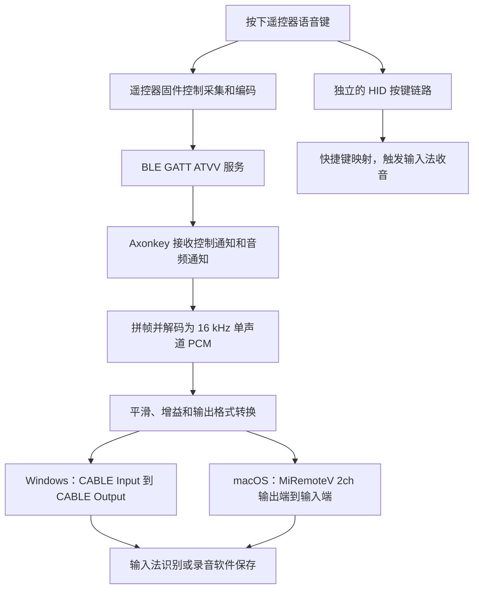
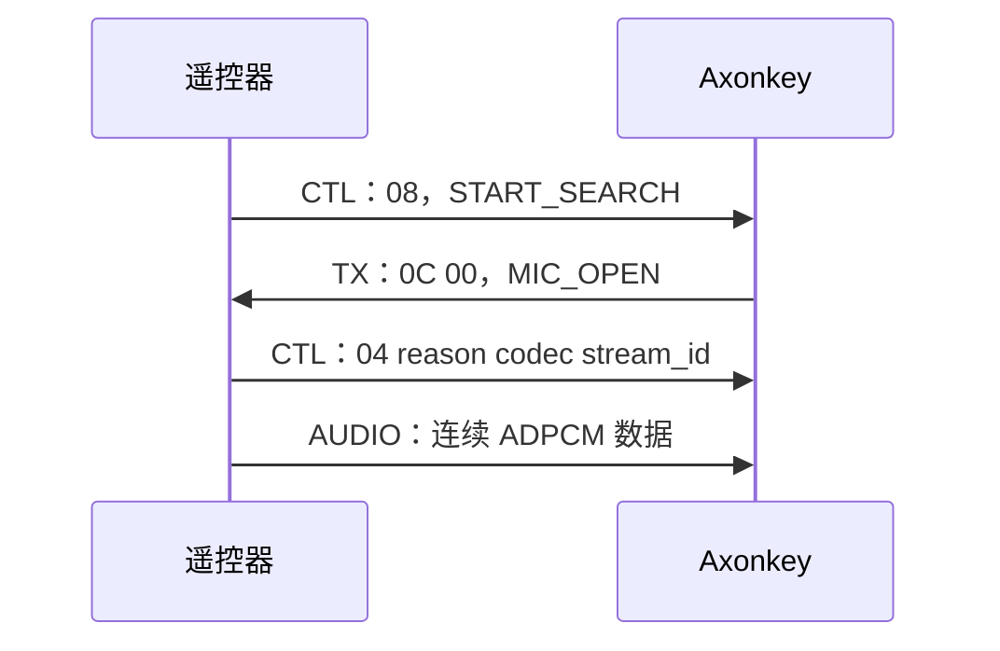
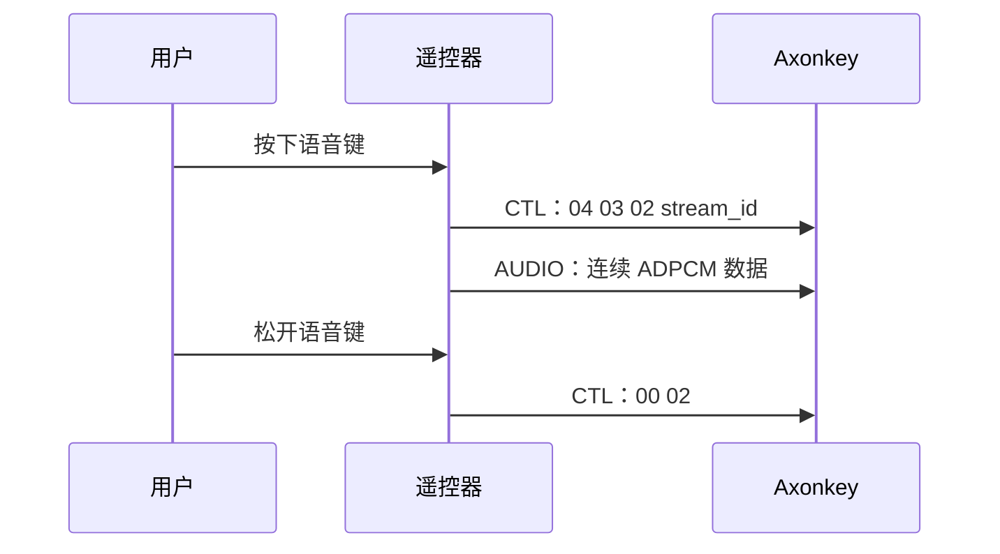

# RC003 麦克风通信流程与音频数据格式

本文说明小米 RC003 遥控器语音在 Axonkey 中的通信、控制包解析、ADPCM 解码和虚拟麦克风输出流程。

分析日期：2026-09-17。依据为当前仓库源码及 Android 官方仓库中的 ATVV 参考固件。本文没有进行本机蓝牙抓包；十六进制示例均用于说明字段，不代表这台遥控器实际发送过的报文。

## 1. 范围与阅读约定

- **项目行为**：由 Axonkey 源码直接确认。
- **参考协议格式**：由 Android ATVV 参考固件补充，不能据此认定 RC003 使用相同芯片或完全相同的固件。
- **待实测信息**：实际协商结果、通知长度、同步频率、时序和延迟，需要日志或抓包确认。
- 字节偏移从 `0` 开始；报文字节使用十六进制表示，例如 `78` 表示十进制 `120`。
- 本文包格式描述的是 **GATT Characteristic Value**，不包含底层蓝牙链路包头、ATT 操作码或属性句柄。
- 遥控器内部麦克风接口、采样电路和固件不在本仓库中。采集端硬件细节不能由电脑端代码直接确定。

## 2. 整体链路与职责



Axonkey 是实时音频桥接程序。遥控器提供压缩音频，Axonkey 解码并写入虚拟音频设备，下游应用负责语音识别或录音文件保存。

HID 按键映射与 ATVV 语音是独立链路。默认语音键映射为右 Alt，但右 Alt 本身不是打开遥控器麦克风的 ATVV 命令。输入法已经弹出语音窗口，也不等于音频通道已经正常工作。

## 3. GATT 服务与三个通信特征

电脑通过操作系统蓝牙 API 与遥控器固件通信。一个 GATT Service 包含若干 Characteristic；本项目使用以下服务和特征：

| 对象 | UUID | 数据方向 | 用途 |
|---|---|---|---|
| ATVV 服务 | `AB5E0001-5A21-4F05-BC7D-AF01F617B664` | 双向服务 | 语音服务入口 |
| TX 特征 | `AB5E0002-5A21-4F05-BC7D-AF01F617B664` | 电脑 → 遥控器 | 写入查询、打开和关闭命令 |
| AUDIO 特征 | `AB5E0003-5A21-4F05-BC7D-AF01F617B664` | 遥控器 → 电脑 | 推送压缩音频字节 |
| CTL 特征 | `AB5E0004-5A21-4F05-BC7D-AF01F617B664` | 遥控器 → 电脑 | 推送开始、停止、能力响应和同步事件 |

TX 的方向以主机发送命令为准。解析消息必须结合特征和方向，不能只看首字节：

```text
电脑写 TX：     0A ...  → GET_CAPS，查询能力
遥控器推 CTL：  0A ...  → AUDIO_SYNC，同步解码状态
遥控器推 AUDIO：0A ...  → 0A 本身是压缩音频数据

电脑写 TX：     0C ...  → MIC_OPEN
遥控器推 CTL：  0C ...  → MIC_OPEN_ERROR
```

控制包具有 ATVV 操作码；当前项目的 AUDIO 解码路径直接消费整个特征值，不从中剥离 ATVV 控制操作码。

源码：[Windows 音频服务](../src-tauri/src/audio_service/windows.rs) 中的 UUID 常量和 `VoiceConnection`。

## 4. 连接初始化：先订阅，再协商

`AudioService` 随 Axonkey 启动。Windows 分别运行音频输出线程与 BLE 工作线程；音频输出可用后，BLE 线程开始连接语音服务。

初始化顺序如下：

```text
找到目标 RC003 的 ATVV 服务
    ↓
取得 TX、AUDIO、CTL 三个特征
    ↓
注册 AUDIO、CTL 数据变化回调
    ↓
开启两个特征的通知
    ↓
通过 TX 发送 GET_CAPS
    ↓
通过 CTL 接收 CAPS_RESP
    ↓
确认支持 16 kHz，进入 ready
```

Windows 按语音服务 UUID 查找设备，并检查设备标识中的目标 VID/PID。macOS 使用 CoreBluetooth 发现服务；设备发现细节与 Windows 不同，语音控制及解码流程相近。

### 4.1 通知与写入方式

Windows 的 `enable_notifications` 优先选择 `Notify`，只支持 `Indicate` 时使用后者，并通过系统 API 写入客户端特征配置描述符。开启通知后，遥控器可主动推送音频，电脑不需要轮询读取每个音频包。

Windows 与 macOS 写 TX 时均优先使用 `WriteWithoutResponse`，不支持时使用 `WriteWithResponse`。macOS 等 AUDIO、CTL 两个通知订阅成功后才查询能力。

一次 GATT 写入完成不等于麦克风已经开始提供音频。应用层还需要观察 CTL 开始事件和 AUDIO 数据。尤其是无响应写入，不应把命令提交当成遥控器已经执行成功的确认。

### 4.2 连接与录音状态的区别

蓝牙连接可以在用户说话前就准备好。`ready` 表示通道和能力已就绪，不表示正在录音。

| 状态字段 | 在项目中的用途 |
|---|---|
| `capabilities_confirmed` | 已收到并接受能力响应 |
| `microphone_opened` | 已进入打开麦克风的命令流程，用于避免重复打开 |
| `streaming` | 正在接受语音流 |
| `session_id` | 开始包携带的音频流 ID，用于主动关闭 |
| `frame_size` | 当前解码拼帧使用的字节数 |
| `last_voice_stop` | 用于抑制停止后迟到的数据 |

这些字段是应用本地状态，不能单独证明遥控器物理采集电路的实时状态。

## 5. 能力协商数据包

### 5.1 GET_CAPS：电脑写 TX

Axonkey 固定发送 6 字节：

```text
0A 01 00 00 03 03
```

| 偏移 | 长度 | 当前值 | 含义 |
|---|---:|---|---|
| 0 | 1 | `0A` | GET_CAPS 操作码 |
| 1 | 1 | `01` | 主版本 |
| 2 | 1 | `00` | 次版本，合起来为 v1.0 |
| 3–4 | 2 | `00 03` | 编码能力字段；参考固件按大端读取 |
| 5 | 1 | `03` | 主机支持的交互模式字段 |

编码能力中，`0x01` 对应 8 kHz ADPCM，`0x02` 对应 16 kHz ADPCM，`0x03` 包含两者。虽然请求声明了两者，当前 Axonkey 后续只接受 16 kHz 流。

参考：[Realtek ATVV 固件 `voice_handle_atvv_srv_cb`](https://android.googlesource.com/platform/hardware/google/atv/refDesignRcu/realtek/+/refs/heads/main/src/app/google_rcu/voice_module/voice.c)。

### 5.2 CAPS_RESP：遥控器推 CTL

v1.0 参考响应布局：

```text
0B major minor codecs model frame_hi frame_lo config reserved
```

| 偏移 | 长度 | 含义 | Axonkey 处理方式 |
|---|---:|---|---|
| 0 | 1 | `0B`，能力响应 | 按此操作码分发 |
| 1–2 | 2 | 协议版本 | 按大端组合为 `u16` |
| 3 | 1 | 编码能力位图 | 优先选择 `0x02` |
| 4 | 1 | 交互模式 | 没有保存为独立模式状态 |
| 5–6 | 2 | 音频帧字节数 | 大端；为 0 时回退到 120 |
| 7 | 1 | 额外配置 | 未解析 |
| 8 | 1 | 保留字段 | 未解析 |

示意：

```text
0B 01 00 03 03 00 78 00 00
                  └───┘
                  0x0078 = 120 字节
```

参考：[Telink ATVV 固件 `google_get_rsp`](https://android.googlesource.com/platform/hardware/telink/atv/refDesignRcu/+/184660d870ebcfadbef674315a79a80b8c14a754/application/audio/gl_audio.c)。

项目要求该响应至少有 7 字节，未要求完整的 9 字节。另有兼容分支：协议版本不低于 `0x0100`，且 `bytes[3] == 0`、`bytes[4] & 0x03 != 0` 时，尝试使用 `bytes[4]` 作为编码位图。

这一兼容分支不改变 v1.0 参考格式中偏移 4 的定义，也不能作为所有设备均采用另一布局的证据。

如果最终不能选择 `0x02`，项目将状态设为错误，不确认语音能力。

## 6. 开始语音：两条有效路径

ATVV 1.0 不要求每次都经历 `08 → 0C → 04`。应根据交互模式区分主机请求开启和遥控器主动开启。

### 6.1 主机请求开启



`START_SEARCH` 的操作码为 `08`。项目收到它后检查能力已确认、没有重复打开、没有正在传输，并检查或准备音频输出；满足条件才发送 MIC_OPEN。

MIC_OPEN 的版本差异：

| 版本 | 格式 | 当前项目发送示例 |
|---|---|---|
| v1.0 及以上分支 | `0C mode` | `0C 00` |
| 旧版分支 | `0C codec_hi codec_lo` | 选择 16 kHz 时为 `0C 00 02` |

v1.0 中的 `00` 是音频消费模式，不是 codec，也不是 stream ID。参考固件将 `00` 定义为 Playback，`01` 定义为 Capture；Axonkey 固定使用 `00`，本文不将模式名称扩展解释为 RC003 内部算法已知的具体行为。

参考：[Telink `MicOpenMode_TypeDef`](https://android.googlesource.com/platform/hardware/telink/atv/refDesignRcu/+/86f501098fb4ba60954cb046201ffe43ca360c3e/application/audio/gl_audio.h)。

### 6.2 遥控器主动开启

PTT/HTT 模式可由遥控器直接发送 AUDIO_START。以下为按住说话 HTT 的示意：



这条路径不需要主机在每次按下时补发 `0C`。Axonkey 接受已协商后的 AUDIO_START，不要求 `microphone_opened` 已经为真。

参考：[Telink `app_audio_key_start`](https://android.googlesource.com/platform/hardware/telink/atv/refDesignRcu/+/184660d870ebcfadbef674315a79a80b8c14a754/application/audio/gl_audio.c)。具体 RC003 使用的路径需要实际报文确认。

## 7. AUDIO_START 包与会话初始化

v1.0 的开始包为：

```text
04 reason codec stream_id
```

| 偏移 | 长度 | 含义 |
|---|---:|---|
| 0 | 1 | `04`，AUDIO_START |
| 1 | 1 | 开始原因 |
| 2 | 1 | 本次流实际使用的编码 |
| 3 | 1 | 音频流 ID |

参考原因码：`00` 表示 MIC_OPEN 请求，`01` 表示 PTT，`03` 表示 HTT。定义见 [Telink `AudioStartReason_TypeDef`](https://android.googlesource.com/platform/hardware/telink/atv/refDesignRcu/+/86f501098fb4ba60954cb046201ffe43ca360c3e/application/audio/gl_audio.h)。

示意：

```text
04 03 02 05
   │  │  └─ 本次流 ID = 5
   │  └──── 16 kHz ADPCM
   └─────── 因 HTT 开始
```

能力响应描述“支持哪些编码”，AUDIO_START 描述“这次实际使用什么编码”。

Windows 收到合法开始事件后会保存流 ID、设置 `streaming = true`、清除停止时间、重置解码器，并清空旧 PCM 队列，然后进入 `forwarding`。

项目没有解析开始原因。它允许短于 3 字节的开始包通过；如果携带了编码字段，则要求它为 `02`；缺少流 ID 时取 0。这是当前实现的容错行为，不等于标准 v1.0 完整格式只需要一个字节。

macOS 通过原生桥接发送会话开始事件给 Rust，Rust 重置共用解码器；原生层准备 AVAudioEngine 输出。

## 8. AUDIO 字节流与拼帧

当前 AUDIO 数据路径将整个特征值送入解码器：

```text
┌────────┬────────┬────────┬────────┬─────┐
│ byte 0 │ byte 1 │ byte 2 │ byte 3 │ ... │
└────────┴────────┴────────┴────────┴─────┘
        全部作为 ADPCM 编码字节累积
```

项目不从 AUDIO 值中剥离帧头、序号、时间戳、校验字段或 WAV 头。不要把其他遥控器或协议版本的带头音频帧直接套用到这段解码器。

### 8.1 通知包与解码帧是两个概念

接收逻辑为：

```text
pending += 本次通知字节
frame_count = pending.length / frame_size
取出 frame_count 个完整帧
剩余不足一帧的字节留给下次
```

假设帧大小为 120 字节，下表仅演示任意分片的累积行为：

| 本次通知长度 | 累积情况 | 解码输出 |
|---:|---|---|
| 50 字节 | 剩余 50 | 0 帧 |
| 50 字节 | 剩余 100 | 0 帧 |
| 50 字节 | 取走 120，剩余 30 | 1 帧 |
| 210 字节 | 30 + 210 = 240，全部取走 | 2 帧 |

表中的长度不是 RC003 抓包结果；源码未固定通知必须恰好为 120 字节。

### 8.2 数据量与声音时长

```text
1 字节 = 2 个 4-bit ADPCM 编码
       = 解码后 2 个 i16 PCM 样本

120 字节 → 240 个样本 → 480 字节的 i16 PCM
240 / 16000 = 0.015 秒 = 15 ms
```

按连续 16 kHz 单声道计算，ADPCM 有效载荷约为 8,000 字节/秒，即 64 kbit/s；解码后的 16 位 PCM 约为 32,000 字节/秒。两者都不包含传输协议开销。

15 ms 是一帧代表的声音时长，不是保证的回调周期或端到端延迟。蓝牙传输、系统调度和输出缓冲均会影响到达与播放时刻。

源码：[AtvvDecoder::append](../src-tauri/src/audio_service/atvv.rs)。

## 9. IMA ADPCM 如何还原 PCM

### 9.1 半字节顺序和状态

每字节先解高 4 位，再解低 4 位：

```text
7F = 0111 1111
     └──┘ └──┘
     先解  后解
      7     F
```

解码器维护：

| 状态 | 作用 |
|---|---|
| `predictor` | 当前预测值，即上一个解码样本 |
| `step_index` | 在 89 项步长表中选择当前步长 |
| `pending` | 尚未拼成完整帧的字节 |
| `pending_sync` | 等待下一完整帧应用的同步状态 |

一个 nibble 的最高位控制差值正负，低三位控制差值大小：

```text
bit 3：负向还是正向变化
bit 2：是否加入 step
bit 1：是否加入 step / 2
bit 0：是否加入 step / 4
```

### 9.2 解码计算

```text
step = STEP_TABLE[step_index]
difference = step >> 3

若 bit0 = 1：difference += step >> 2
若 bit1 = 1：difference += step >> 1
若 bit2 = 1：difference += step

若 bit3 = 1：predictor -= difference
否则：        predictor += difference

predictor 限制在 [-32768, 32767]
输出 predictor

step_index += INDEX_TABLE[nibble & 7]
step_index 限制在 [0, 88]
```

索引调整表为：

```text
低三位： 0   1   2   3   4  5  6  7
调整量：-1  -1  -1  -1   2  4  6  8
```

### 9.3 手算一个字节

从 `predictor = 0`、`step_index = 0` 开始解码 `7F`：

```text
nibble 7：
  step = 7
  difference = 0 + 1 + 3 + 7 = 11
  predictor = 11
  step_index = 8

nibble F：
  step = 16
  difference = 2 + 4 + 8 + 16 = 30
  符号为负
  predictor = 11 - 30 = -19

输出两个样本：[11, -19]
```

项目的 `decoder_uses_rc003_high_nibble_order` 测试验证了这一结果。

帧与帧之间继承 predictor 和 step index，不会每 120 字节归零。会话重置或同步消息才会改变这一连续状态。

### 9.4 解码后平滑

每帧内部使用三点加权平滑：

```text
y[i] = (x[i-1] + 2*x[i] + x[i+1]) >> 2
```

首尾样本不变。平滑基于原始解码帧的副本计算，不会反过来修改 ADPCM predictor，也不是在压缩字节上处理。

源码：[decode、decode_nibble 与 smooth](../src-tauri/src/audio_service/atvv.rs)。

## 10. AUDIO_SYNC：恢复解码状态

ADPCM 依赖历史状态，因此任意截取一段音频字节、从零开始解码，不一定能还原正确波形。

v1.0 CTL 同步包格式：

```text
0A codec seq_hi seq_lo predictor_hi predictor_lo step_index
```

| 偏移 | 长度 | 含义 | 项目是否使用 |
|---|---:|---|---|
| 0 | 1 | `0A`，AUDIO_SYNC | 是 |
| 1 | 1 | 编码标识 | 否 |
| 2–3 | 2 | 帧序号，大端 | 否 |
| 4–5 | 2 | predictor，有符号 16 位、大端 | 是 |
| 6 | 1 | 步长索引 | 是 |

参考：[Realtek `voice_handle_atv_audio_sync`](https://android.googlesource.com/platform/hardware/google/atv/refDesignRcu/realtek/+/refs/heads/main/src/app/google_rcu/voice_module/voice.c)。

示意：

```text
0A 02 00 2A FF 9C 10

codec      = 02
帧序号     = 0x002A = 42
predictor  = 0xFF9C，按 i16 解释为 -100
step_index = 0x10 = 16
```

Axonkey 的处理为：

```text
收到至少 7 字节的同步消息
    ↓
清空 pending 中未解码的字节
    ↓
保存新的 predictor 和 step_index 到 pending_sync
    ↓
下一次拼出完整帧时应用新状态
    ↓
继续正常解码
```

应用同步时，predictor 被限制在 i16 范围，step index 被限制在 0～88。

当前实现没有按同步包序号定位特定帧，也没有应用层重排、补帧或重传。它依赖同步与音频通知到达时的对应关系；同步时存在半帧，会直接舍弃。这是实现边界，不能据此直接认定实际发生了丢包或失真。底层蓝牙可靠传输由系统协议栈处理，与这里的应用层逻辑不同。

## 11. 停止、关闭和错误消息

### 11.1 AUDIO_STOP：遥控器推 CTL

v1.0 格式：

```text
00 reason
```

| 原因码 | 参考含义 |
|---|---|
| `00` | 收到 MIC_CLOSE |
| `02` | 松开 HTT 按键 |
| `04` | 为新的 AUDIO_START 停止当前流 |
| `08` | 传输超时 |
| `10` | 音频通知被禁用 |
| `80` | 其他原因 |

原因定义见 [Telink `AudioStop_TypeDef`](https://android.googlesource.com/platform/hardware/telink/atv/refDesignRcu/+/86f501098fb4ba60954cb046201ffe43ca360c3e/application/audio/gl_audio.h)。

Axonkey 只按首字节 `00` 结束会话，不解析停止原因。它重置解码器，并清除 streaming、microphone-opened 状态。

Windows 立即清空待输出 PCM，防止旧队列继续播放；如果当时存在积压，可能舍弃部分尾音。macOS 等已经调度的缓冲播放完成再停引擎，最长设置 3 秒的排空等待。

### 11.2 停止后的迟到音频

两平台在未 streaming 且距离上次停止不足 300 ms 时拒收音频，避免迟到的旧数据立即恢复会话。显式合法 AUDIO_START 可以启动新会话，这不是所有新会话都必须等待的冷却期。

如果能力已确认、当前没有 streaming，且不处于上述窗口，单独收到音频也可以将状态恢复为 streaming。这是容错路径，不能推断每次开始都必然收到 `04`。

### 11.3 MIC_CLOSE：电脑写 TX

```text
v1.0：0D stream_id
旧版：0D
```

例如 `0D 05` 用于关闭 ID 为 5 的流。项目在关闭活动连接或停止服务等情况下尝试发送。收到 AUDIO_STOP 后不会固定再回一个 MIC_CLOSE。

### 11.4 MIC_OPEN_ERROR 与续时

CTL 错误包格式为：

```text
0C error_hi error_lo
```

项目没有专门解析该操作码的错误字段，因此无法仅凭当前业务状态得到具体的开麦失败原因。参考格式见 [Realtek `voice_handle_atvv_mic_open_error`](https://android.googlesource.com/platform/hardware/google/atv/refDesignRcu/realtek/+/refs/heads/main/src/app/google_rcu/voice_module/voice.c)。

参考固件还支持 TX 上的 `0E stream_id` 续时命令；当前 Axonkey 未发送该命令。是否影响某个固件的长时间会话，需要实际验证，不能据此推断 RC003 的具体超时时长。

## 12. PCM 到虚拟麦克风

### 12.1 Windows

```text
ADPCM 解码和平滑
    ↓
VecDeque<i16> PCM 队列
    ↓
CPAL 输出回调
    ↓
采样率转换、增益、限幅、声道填充
    ↓
CABLE Input 播放端点
    ↓
CABLE Output 录音端点
```

- 起播预缓冲阈值为 320 个源样本，即 20 ms；按 120 字节帧到达时，一帧只有 240 样本，通常需要累计到第二帧才能超过阈值。实际起播时间还受调度影响。
- PCM 队列上限目标为 32,000 个源样本，约 2 秒；正常帧入队造成溢出时丢弃最旧的排队样本。
- 输出游标通过线性插值将 16 kHz 源转换到设备采样率。
- 增益倍率为 `10^(gain_db / 20)`，范围为 -30～+30 dB，输出限幅到 `[-1, 1]`。
- 同一个单声道值填充到输出帧的各声道；这不会产生真正的立体声信息。
- 队列不足或未取得队列锁时，相应输出填零。

`CABLE Input` 是虚拟线缆的播放入口，`CABLE Output` 是提供给录音应用的出口。Axonkey 自行选择前者，输入法应选择后者作为麦克风。

源码：[OutputCursor 与 fill_output](../src-tauri/src/audio_service/windows.rs)。

### 12.2 macOS

Rust 共用同一个 `AtvvDecoder`，通过桥接将 PCM 交给 Objective-C。原生层转换为 16 kHz 单声道 float32、应用增益与限幅，再交给 AVAudioPlayerNode 调度，并绑定到 MiRemoteV 2ch 的输出设备。

音频引擎只在语音会话需要输出时运行；结束后排空已调度缓冲并停止。下游应用选择 MiRemoteV 2ch 输入端收音。

源码：[Rust macOS 桥接](../src-tauri/src/audio_service/macos.rs)、[原生音频实现](../src-tauri/native/macos_audio.m)。

## 13. 完整通信示例

以下假设协商为 v1.0、16 kHz、120 字节帧、HTT，流 ID 为 5。所有内容均为示意，未反映实测时间间隔；同步消息的出现频率也未作假设。

```text
① 电脑开启 AUDIO、CTL 通知。

② 电脑 → TX
   0A 01 00 00 03 03
   查询能力并声明主机支持的参数。

③ 遥控器 → CTL
   0B 01 00 03 03 00 78 00 00
   返回版本、编码、模式和 120 字节帧大小。

④ 用户按下语音键。

⑤ 遥控器 → CTL
   04 03 02 05
   HTT 开始，16 kHz，流 ID 5。

⑥ 遥控器 → AUDIO
   [ADPCM 字节……]
   Axonkey 累积到 120 字节，解码出 240 个 PCM 样本。

⑦ 遥控器 → AUDIO
   [更多 ADPCM 字节……]
   继承上一帧的解码状态，持续输出。

⑧ 传输期间可能收到 CTL 同步：
   0A 02 00 2A FF 9C 10
   下一完整帧应用 predictor=-100、step_index=16。

⑨ 用户松开语音键。

⑩ 遥控器 → CTL
   00 02
   因 HTT 释放而结束当前音频流。
```

## 14. 当前实现边界与排查证据

| 项目行为或边界 | 分析时应注意的含义 |
|---|---|
| 仅接受 16 kHz ADPCM | 不能推断支持全部 ATVV codec |
| MIC_OPEN、MIC_CLOSE 有版本分支 | 不等于完整实现了旧版 ATVV；例如旧版带头音频未单独解析 |
| 不保存交互模式和开始原因 | 不能仅靠当前状态字段确定实际按键启动路径 |
| 不解析 AUDIO_STOP 原因 | 无法区分松键、超时或主机关闭等具体原因 |
| 不解析 MIC_OPEN_ERROR 错误字段 | 开麦失败诊断信息不完整 |
| 同步序号未参与匹配 | 没有按序号恢复、重排或补帧 |
| 未发送 MIC_EXTEND | 长会话行为需要按设备固件实测 |
| 数据到达可容错恢复 streaming | 不应假定日志中每段音频都有显式开始事件 |
| Windows 停止即清队列 | 可能在积压时舍弃待播放尾音 |

现有 INFO 诊断可沿链路判断问题位置：

| 观察项 | 可以说明什么 | 不能单独证明什么 |
|---|---|---|
| `rx_packets` / `rx_bytes` | 音频通知已到应用 | 波形正确或下游已收音 |
| `decoded_samples` | 已产出 PCM 样本 | 解码后的信号有正常人声 |
| `pcm_peak` / `pcm_rms` | 增益前 PCM 电平 | 原始采集硬件一定正常 |
| Windows `consumed_samples` | 源 PCM 已从输出队列消费 | 输入法已收到或识别 |
| Windows `unfilled_output_frames` | 因供给不足等原因填零的输出帧 | 内容本身一定是静音 |
| macOS `scheduled_samples` | 样本已成功调度 | 已经播放完成 |
| macOS `played_samples` | 当前播放器报告播放完成 | 下游应用已收音 |

需要进一步还原真实通信时，优先记录：

1. TX/CTL/AUDIO 特征类型、方向和单调时间戳。
2. 控制包完整字节，尤其是 CAPS_RESP、AUDIO_START、AUDIO_STOP 和 AUDIO_SYNC。
3. 每条音频通知的长度及到达间隔。
4. 会话 ID、同步序号、拼帧缓冲余量和输出队列深度。
5. 如果需要验证编码正确性，再在用户明确需要的诊断场景中保存音频内容作离线比对。

当前常规运行日志不保存音频包内容、PCM 或识别文本，也没有完整保留上述控制包字段。本文中的通知长度、同步频率、精确启动时序和延迟因此仍属于待实测信息。

## 15. 源码与资料索引

| 文件或资料 | 重点内容 |
|---|---|
| [windows.rs](../src-tauri/src/audio_service/windows.rs) | GATT 连接、订阅、控制包、音频入队、CPAL 输出 |
| [atvv.rs](../src-tauri/src/audio_service/atvv.rs) | 字节累积、IMA ADPCM、同步和平滑 |
| [macos.rs](../src-tauri/src/audio_service/macos.rs) | 原生事件与 Rust 解码器桥接 |
| [macos_audio.m](../src-tauri/native/macos_audio.m) | CoreBluetooth 控制与 AVAudioEngine 输出 |
| [diagnostics.rs](../src-tauri/src/audio_service/diagnostics.rs) | 收包、解码、电平与播放统计 |
| [lib.rs](../src-tauri/src/lib.rs) | AudioService 启动与前端命令入口 |
| [behaviorModel.ts](../src/behaviorModel.ts) | 默认语音键快捷键映射 |
| [ARCHITECTURE.md](ARCHITECTURE.md) | 跨平台整体架构 |
| [README 诊断说明](../README.md) | 驱动设置和运行日志字段说明 |
| [Android Realtek voice.c](https://android.googlesource.com/platform/hardware/google/atv/refDesignRcu/realtek/+/refs/heads/main/src/app/google_rcu/voice_module/voice.c) | ATVV 参考消息构造与处理 |
| [Android Telink gl_audio.c](https://android.googlesource.com/platform/hardware/telink/atv/refDesignRcu/+/184660d870ebcfadbef674315a79a80b8c14a754/application/audio/gl_audio.c) | 能力响应与交互流程参考 |
| [Android Telink gl_audio.h](https://android.googlesource.com/platform/hardware/telink/atv/refDesignRcu/+/86f501098fb4ba60954cb046201ffe43ca360c3e/application/audio/gl_audio.h) | 操作码、原因码和模式枚举 |
