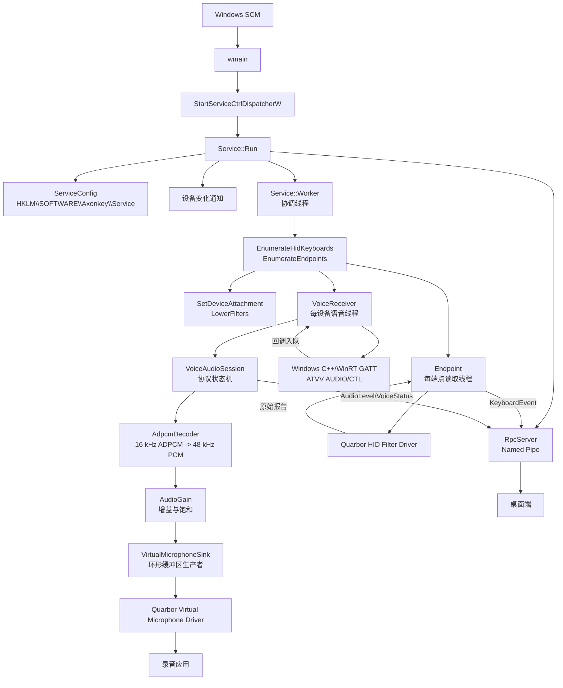
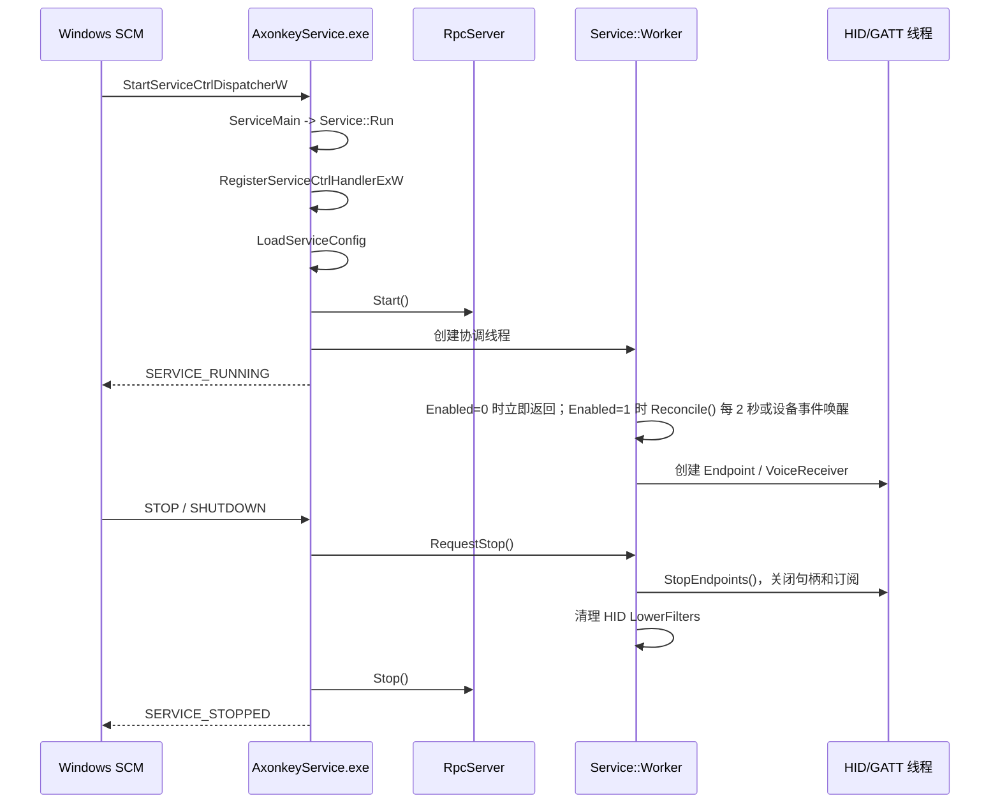
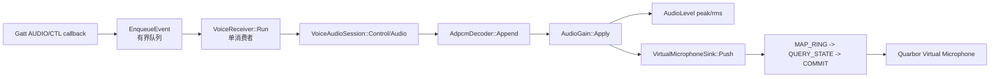

# AxonkeyService 服务运行框架导读

> 本文按当前 `windows/service` 源码整理，目标是回答三个问题：服务由哪些线程和模块组成、数据如何流动、遇到问题时应该从哪个函数开始看。
>
> 行号以本文编写时的源码为准；源码修改后，建议以 IDE 的跳转结果为最终位置。

## 1. 一句话结论

`AxonkeyService.exe` 是一个由 Windows Service Control Manager（SCM）托管的
单进程服务。进程内同时承担四类工作：

1. 一个服务协调线程，周期性枚举 RC003 HID 键盘、挂载过滤器并维护连接。
2. 每个 HID 端点一个重叠 I/O 读取线程，读取原始 HID 报告并屏蔽 Windows 原始输入。
3. 每个 RC003 设备一个 C++/WinRT GATT 语音线程，接收 ATVV 音频并写入虚拟麦克风。
4. 一个命名管道 RPC 接收线程，以及每个 RPC 客户端一个请求线程、一个发送线程和一个写超时监视线程。

服务不直接实现内核驱动，而是通过 `SetupAPI/CfgMgr32` 管理
`QuarborHIDFilterDriver`，通过 `DeviceIoControl` 使用 HID 过滤驱动和虚拟麦克风驱动。

## 2. 总体架构图



### 组件职责

| 组件 | 主要文件 | 职责边界 |
| --- | --- | --- |
| 服务入口与生命周期 | [`main.cpp`](main.cpp) | 注册 SCM 回调、启动/停止线程、周期协调设备 |
| HID 设备协调 | [`main.cpp`](main.cpp)、`QuarborDeviceSetup.*` | 枚举 Keyboard、写入设备 `LowerFilters`、发现端点 |
| HID 端点读取 | [`main.cpp`](main.cpp) 中 `Endpoint` | 打开端点、设置转发/拦截、异步读报告 |
| 蓝牙语音接收 | [`VoiceReceiver.cpp`](VoiceReceiver.cpp) | GATT 发现、订阅通知、事件队列、连接清理 |
| 语音协议状态机 | [`VoiceAudioSession.cpp`](VoiceAudioSession.cpp) | 处理 CTL 命令、管理一次语音会话 |
| 音频解码 | [`AdpcmDecoder.h`](AdpcmDecoder.h) | ADPCM 解码、平滑、16 kHz 到 48 kHz 插值 |
| 音频输出 | [`VirtualMicrophoneSink.cpp`](VirtualMicrophoneSink.cpp) | 映射虚拟麦克风环形缓冲区并提交 PCM |
| RPC | [`RpcServer.cpp`](RpcServer.cpp)、[`RpcServer.h`](RpcServer.h) | 命名管道帧传输、请求分发、事件发布 |
| 配置 | [`ServiceConfig.cpp`](ServiceConfig.cpp) | 读取/保存总开关、增益和改键表配置 |
| 日志 | [`ServiceLog.cpp`](ServiceLog.cpp) | spdlog 文件/调试器双写和大小限制 |

## 3. 启动、运行、停止时序



关键入口位置：

- `wmain()`：[`main.cpp:422`](main.cpp#L422)，创建服务表并进入 SCM dispatcher。
- `ServiceMain()`：[`main.cpp:419`](main.cpp#L419)，转入单例 `Service::Run()`。
- `Service::Run()`：[`main.cpp:199`](main.cpp#L199)，完成服务状态、配置、RPC、设备通知和工作线程初始化。
- `Service::Handler()`：[`main.cpp:248`](main.cpp#L248)，处理停止、关机和设备变化事件。
- `Service::Worker()`：[`main.cpp:268`](main.cpp#L268)，主循环和停止时的资源回收。

### 启动阶段的实际顺序

`Service::Run()` 的顺序很重要：

1. 注册 `RegisterServiceCtrlHandlerExW`，状态设为 `SERVICE_START_PENDING`。
2. 创建 `stopEvent_`，随后通过 `LoadServiceConfig()` 读取 64 位注册表配置。
   `Enabled` 缺失时物化为 `1`；禁用状态下工作线程仍运行但设备初始化流程首行直接返回。
3. 构造 `RpcServer` 并调用 `RpcServer::Start()`。首次管道实例创建失败会同步报告失败，不会假装 RPC 已就绪。
4. 注册键盘设备接口通知。通知注册失败不会阻止服务运行，因为 `Worker()` 仍会每 2 秒扫描。
5. 创建 `worker_`，状态设为 `SERVICE_RUNNING`，等待 `stopEvent_`。

### 停止阶段的资源顺序

停止请求只做“发信号”：`Handler()` 调用 `RequestStop()`，后者设置 `stopEvent_` 并唤醒条件变量。
真正的清理在工作线程和 `Run()` 中完成：

1. `Worker()` 跳出循环，调用 `StopEndpoints()`，依靠 `shared_ptr` 析构 `Endpoint` 和 `VoiceReceiver`。
2. 语音线程先取消虚拟麦克风等待、关闭 GATT 订阅和对象。
3. HID 句柄全部关闭后，遍历离线/在线设备并移除 `QuarborHIDFilterDriver` 挂载。
4. `Run()` 等待工作线程结束后停止 RPC、注销设备通知、关闭停止事件，并上报 `SERVICE_STOPPED`。

## 4. 服务协调与 HID 输入路径

### 4.1 设备筛选与挂载

`Service::Reconcile()` 位于 [`main.cpp:289`](main.cpp#L289)，其设备初始化流程首行检查 `Enabled`：

- `Enabled=0`：直接返回，不枚举、挂载设备，也不创建端点或语音线程。
- `Enabled=1`：继续执行以下协调步骤：

1. 调用 `quarbor::EnumerateHidKeyboards(true)` 获取在线 HID Keyboard collection。
2. 调用 [`ServiceConfig.cpp:27`](ServiceConfig.cpp#L27) 的 `IsRc003()`，按 `VID_2717`/`VID&012717` 和 `PID_32B8`/`PID&32B8` 匹配 RC003。
3. 对未挂载实例调用 `quarbor::SetDeviceAttachment(..., true, true)`，将过滤器写入设备 `LowerFilters` 并请求设备属性变更。
4. 调用 `EnumerateEndpoints()`（[`main.cpp:40`](main.cpp#L40)）枚举 `GUID_DEVINTERFACE_QUARBOR_HID` 端点。
5. 为每个新端点创建 `Endpoint`，为每个新目标设备创建 `VoiceReceiver`。

设备挂载 API 的实现位于 `windows/driver/shared/src/QuarborDeviceSetup.cpp`；服务只负责调用，
不在 `windows/service` 内重复实现注册表和 SetupAPI 细节。对应实现位置是：

- `quarbor::EnumerateHidKeyboards()`：[`QuarborDeviceSetup.cpp:161`](../driver/shared/src/QuarborDeviceSetup.cpp#L161)。
- `quarbor::SetDeviceAttachment()`：[`QuarborDeviceSetup.cpp:187`](../driver/shared/src/QuarborDeviceSetup.cpp#L187)。
- `quarbor::ClearFilterRegistrations()`：[`QuarborDeviceSetup.cpp:252`](../driver/shared/src/QuarborDeviceSetup.cpp#L252)，用于驱动包卸载/清理场景。

### 4.2 Endpoint 的打开与读取

`Endpoint` 是 `main.cpp:76-194` 的内部类，生命周期由 `Service::active_` 持有：

- 构造函数 [`main.cpp:79`](main.cpp#L79)：用 `CreateFileW` 独占打开端点，创建事件，调用 `IOCTL_QUARBOR_QUERY_IDENTITY` 校验 ABI 和最大报告长度。
- 构造函数随后打开两个开关：`IOCTL_QUARBOR_SET_DATA_FORWARD` 将原始报告转发给服务，`IOCTL_QUARBOR_SET_INPUT_BLOCK` 屏蔽送给 Windows 的原始输入。
- `Start()` [`main.cpp:116`](main.cpp#L116)：创建一个读取线程。
- `ReadLoop()` [`main.cpp:152`](main.cpp#L152)：以 `IOCTL_QUARBOR_HID_DATA` 发起重叠读取，等待“数据事件”或“停止事件”；取消时调用 `CancelAndDrain()`，确保 `OVERLAPPED`、事件和缓冲区仍存活到 I/O 完成。
- `OnHidReport()` [`main.cpp:182`](main.cpp#L182)：只做复制和回调，不解析 usage；回调最终进入 `RpcServer::PublishKeyboard()`。
- `Stop()` [`main.cpp:117`](main.cpp#L117)：先发停止信号、等待读线程，再关闭拦截/转发开关和句柄。

读线程因设备移除、I/O 错误或服务停止而退出时，会发布一个 `KeyboardEvent` 空
`report` 作为该端点的 reset 通知。桌面端收到后释放当前合成输出；管道连接无需
断开，下一次设备协调即可继续发布新的完整 report。

因此，当前服务的输入策略是“原始报告上送 RPC + 驱动层全部拦截”。桌面端可以解析报告，
但服务本身不负责把报告重新注入 Windows 输入栈。

## 5. RC003 蓝牙语音路径



### 5.1 GATT 连接和事件线程

`VoiceReceiver::Run()` 位于 [`VoiceReceiver.cpp:261`](VoiceReceiver.cpp#L261)：

1. 初始化 C++/WinRT 多线程 apartment。
2. `ConnectGatt()`（[`VoiceReceiver.cpp:178`](VoiceReceiver.cpp#L178)）按 ATVV 服务 UUID 枚举 GATT service，并通过 `IsTargetServiceId()` 确认属于当前 HID 实例。
3. 查找 TX、AUDIO、CTL 三个 characteristic；`GattAccess.h` 中的 `RequireGattSession()` 和 `FindCharacteristic()` 对空对象、发现失败和空集合做显式检查。
4. 为 AUDIO/CTL 注册 `ValueChanged` 回调并开启 Notify/Indicate。
5. 向 TX 写入 `0A 01 00 00 03 03` 请求能力信息。
6. 回调只执行 `EventBytes()` 和 `EnqueueEvent()`，不在 WinRT 回调线程解码。队列上限是 64 KiB 或 1024 个事件；溢出时标记 `overflow`，由工作线程终止连接，避免丢 ADPCM 中间字节后继续使用错误预测器。
7. `Run()` 单线程按入队顺序调用 `session->Audio()` 或 `session->Control()`，并更新 `VoiceStatus`。

这是一条明确的线程边界：GATT 回调生产事件，`VoiceReceiver::Run()` 是唯一的协议消费者，
`VoiceAudioSession` 不需要额外锁。

### 5.2 VoiceAudioSession 状态机

实现位于 [`VoiceAudioSession.cpp`](VoiceAudioSession.cpp)，状态主要由 `capabilities_`、`active_`、
`microphoneOpen_`、`rejected_` 和 `ended_` 共同表达。

| CTL 首字节 | 处理位置 | 语义 |
| --- | --- | --- |
| `0x0B` | [`VoiceAudioSession.cpp:58`](VoiceAudioSession.cpp#L58) | 读取协议版本、codec 位和 ADPCM frame bytes |
| `0x08` | [`VoiceAudioSession.cpp:73`](VoiceAudioSession.cpp#L73) | 请求开始语音；成功独占虚拟麦克风后回复 `0C 00`（旧协议附带 codec） |
| `0x04` | [`VoiceAudioSession.cpp:86`](VoiceAudioSession.cpp#L86) | 远端确认/开始音频；复用已取得的麦克风会话 |
| `0x0A` | [`VoiceAudioSession.cpp:99`](VoiceAudioSession.cpp#L99) | 同步 ADPCM predictor 和 step index |
| `0x00` | [`VoiceAudioSession.cpp:103`](VoiceAudioSession.cpp#L103) | 结束本次会话，flush 尾部采样并停止输出 |

`Open()` [`VoiceAudioSession.cpp:26`](VoiceAudioSession.cpp#L26) 只在本次语音会话第一次需要音频时尝试打开虚拟麦克风。
如果设备忙，设置 `rejected_`，该会话剩余 AUDIO 丢弃；不会在同一 utterance 中途抢占其他语音线程。

### 5.3 音频转换、增益和输出

- `AdpcmDecoder::Append()`：[`AdpcmDecoder.h:38`](AdpcmDecoder.h#L38)。按 frame 累积 GATT 分包，4-bit ADPCM 解码后做平滑，再用连续 look-ahead 线性插值从 16 kHz 变为 48 kHz。
- `AdpcmDecoder::Synchronize()`：[`AdpcmDecoder.h:32`](AdpcmDecoder.h#L32)。处理 `0x0A` 的预测器同步，清除跨包缓存。
- `AdpcmDecoder::Flush()`：[`AdpcmDecoder.h:23`](AdpcmDecoder.h#L23)。语音结束时补齐最后插值区间，避免尾音被截断。
- `VoiceAudioSession::PushSamples()`：[`VoiceAudioSession.cpp:8`](VoiceAudioSession.cpp#L8)。先执行增益，再计算 peak/RMS，最后写入麦克风；所以 RPC 的音频电平是增益后的电平。
- `AudioGain::Apply()`：[`AudioGain.h:20`](AudioGain.h#L20)。倍率为 `10^(dB/20)`，范围 `-30..30 dB`，PCM16 饱和后再转换，避免整数回绕。
- `VirtualMicrophoneSink::Start()`：[`VirtualMicrophoneSink.cpp:63`](VirtualMicrophoneSink.cpp#L63)。独占打开 `\\.\QuarborVirtualMicrophone`，执行 `MAP_RING -> RESET -> START`，并严格校验 48 kHz、单声道、16-bit PCM。
- `VirtualMicrophoneSink::Push()`：[`VirtualMicrophoneSink.cpp:124`](VirtualMicrophoneSink.cpp#L124)。查询空闲空间，按最多 960 字节分块，处理环形回绕，内存屏障后用 `COMMIT` 提交；满缓冲区最多等待 250 ms。
- `VirtualMicrophoneSink::Stop(true)`：[`VirtualMicrophoneSink.cpp:159`](VirtualMicrophoneSink.cpp#L159)。正常语音结束会等待已提交尾音排空，服务关闭或失败路径不会无限等待。

## 6. 本地 RPC 框架

RPC 端点固定为 `\\.\pipe\AxonkeyService.v1`，定义在 [`RpcServer.h:30`](RpcServer.h#L30)。
它不是 gRPC 运行时，而是“nanopb 编解码的 protobuf 消息 + 自定义长度帧 + Windows named pipe”：

```text
┌──────────────┬──────────────────────────────┐
│ uint32 LE    │ protobuf bytes               │
│ frame size   │ Request / Response / Event   │
└──────────────┴──────────────────────────────┘
```

- `ReadFrame()` / `WriteFrame()`：[`RpcServer.cpp:53`](RpcServer.cpp#L53)，最大帧 1 MiB。
- `CreatePipe()`：[`RpcServer.cpp:240`](RpcServer.cpp#L240)，创建无限实例、字节流模式且启用 `FILE_FLAG_OVERLAPPED` 的双向管道；ACL 允许 SYSTEM、管理员和已认证用户。同一客户端的请求读取与响应/事件写入可并行进行，不会因同步句柄串行化而互相阻塞。
- `Start()`：[`RpcServer.cpp:259`](RpcServer.cpp#L259)，先同步验证第一个管道实例，再启动 accept 线程。
- `AcceptLoop()`：[`RpcServer.cpp:303`](RpcServer.cpp#L303)，用重叠 `ConnectNamedPipe` 等待连接或停止事件；接受后先创建下一个监听实例，再为当前客户端创建线程，减少客户端看到 `ERROR_PIPE_BUSY` 的窗口。
- `ClientLoop()`：解析请求并调用 `RpcHandlers`；响应只进入该客户端的出站队列，不在请求线程中同步写 Pipe。
- `Client::SenderLoop()`：每个连接独立的发送线程，按入队顺序用重叠 I/O 写入响应和事件，保证 `Subscribe` 响应先于首个事件。每次读写都等待自身的 `OVERLAPPED` 完成后才释放事件与缓冲区。
- `Client::WatchdogLoop()`：监视当前写入，超过 2 秒调用 `CancelIoEx`，随后断开无响应客户端。
- `Publish()`：只复制订阅客户端快照并入队，不持有全局客户端锁执行 I/O；单客户端队列最多 256 帧或 4 MiB，超过即断开慢客户端。

`Service::Run()` 在 [`main.cpp:216`](main.cpp#L216) 把 RPC handler 绑定到服务状态：

- `ServiceInfo()`：服务名、版本 `0.3.1`、协议名和管道名。
- `GetServiceStatus()` / `SetServiceStatus()`：读取或动态切换 `Enabled` 总开关；启用会立即协调设备，禁用会停止端点/语音线程并解绑过滤器，结果持久化到注册表。
- `SetAudioGain()`：[`main.cpp:376`](main.cpp#L376)，限制到 `-30..30 dB`，更新已有 `VoiceReceiver` 并持久化。
- `DeviceList()`：[`main.cpp:384`](main.cpp#L384)，返回挂载状态、端点路径、连接状态和两个 HID 开关；同时尽力读取电量（未知时不设置）和设备描述名称（未知时为空）。
- `VoiceStatus()`：[`main.cpp:401`](main.cpp#L401)，从现有语音线程选取有意义的连接/活动状态。
- `AudioLevel()`：[`main.cpp:410`](main.cpp#L410)，读取最近一次 peak/RMS 快照。

## 7. 配置、日志和构建边界

### 配置

`ServiceConfig.cpp`：

- `IsRc003()`：[`ServiceConfig.cpp:27`](ServiceConfig.cpp#L27)，统一大小写匹配 VID/PID。
- `LoadServiceConfig()`：[`ServiceConfig.cpp:32`](ServiceConfig.cpp#L32)，打开 `HKLM\SOFTWARE\Axonkey\Service` 的 64 位视图。
- `LoadServiceConfigFromKey()`：[`ServiceConfig.cpp:42`](ServiceConfig.cpp#L42)，读取 `Enabled`、`RemapConfig`（`REG_BINARY`）和 `AudioGainDb`（`REG_DWORD`），无效值恢复默认值。
- `SaveAudioGain()`：[`ServiceConfig.cpp:79`](ServiceConfig.cpp#L79)，供 RPC 更新增益。
- `SaveServiceEnabled()`：供 `SetServiceStatus` 持久化总开关。

当前服务启动时读取改键表，但 `Reconcile()` 没有把 `remap` 下发给驱动；因此改键表目前是存储定义，
不是运行时生效路径。

### 日志

`ServiceLog.cpp`：

- `LogPath()` [`ServiceLog.cpp:24`](ServiceLog.cpp#L24) 以 EXE 所在目录为基准生成 `AxonkeyService.log`，不依赖当前工作目录。
- `Logger()` [`ServiceLog.cpp:32`](ServiceLog.cpp#L32) 同时写 MSVC 调试器和 spdlog 文件 sink；单文件上限 100 KiB，启动时检查旧文件大小。
- `LogMessage()` [`ServiceLog.cpp:73`](ServiceLog.cpp#L73) / [`ServiceLog.cpp:79`](ServiceLog.cpp#L79) 保证日志异常不穿透业务代码，并保护调用方的 Win32 `LastError`。

### 构建目标

`CMakeLists.txt` 的关键边界：

- `ServiceLogging` 静态库：[`CMakeLists.txt:13`](CMakeLists.txt#L13)，只包含 `ServiceLog.cpp`。
- `AxonkeyRpc` 静态库：nanopb 运行时 + `protobuf/axonkey_rpc.cpp` + `protobuf/generated/axonkey_service.pb.c`。
- `AxonkeyService` 可执行文件：C++20，依赖 SetupAPI、CfgMgr32、Advapi32、Windows Runtime、OLE32、Shell32、`AxonkeyRpc` 和 shared driver helper。
- C++/WinRT 头从 Windows SDK 的 `cppwinrt` 目录查找。
- Debug symbols：MSVC 下通过 `/Zi` 和 `/DEBUG` 生成 PDB。
- `axonkey_rpc_tests` / `axonkey_rpc_pipe_tests`：编解码往返、经典 wire 兼容性，以及连续请求、订阅事件和关闭期间的管道集成测试（`ctest`）。

## 8. 线程、锁和错误处理要点

| 线程/上下文 | 允许做什么 | 不能忽略的约束 |
| --- | --- | --- |
| SCM 回调 `Handler()` | 设置停止事件、唤醒协调线程 | 不直接关闭设备句柄，不做耗时 SetupAPI 操作 |
| `Service::Worker()` | 枚举、挂载/卸载、创建和销毁子对象 | 修改 `active_`、`voices_`、`targets_` 时持有 `mutex_` |
| `Endpoint::ReadLoop()` | 等待并读取 HID 报告 | 取消重叠 I/O 后必须 `CancelAndDrain()` 再释放资源 |
| GATT `ValueChanged` 回调 | 拷贝数据、入队 | 不解码、不写虚拟麦克风，队列溢出要终止连接 |
| `VoiceReceiver::Run()` | GATT 初始化、事件消费、协议处理、清理 | WinRT apartment 只在该线程初始化/反初始化 |
| RPC accept/client 线程 | 接受连接、读取请求和调用 handler | 响应只入有界出站队列；不在请求线程或全局客户端锁中执行 Pipe 写入 |
| RPC client sender/watchdog 线程 | 串行发送响应/事件、取消超时写入 | 单次写入超过 2 秒或队列超过 256 帧/4 MiB 即断开客户端 |
| 虚拟麦克风 `Push()` | 查询状态、回绕拷贝、提交数据 | 250 ms 无空闲空间即失败，停止时支持取消 |

主要的“失败后自愈”策略是：`Worker()` 每 2 秒重试 `Reconcile()`；失败的 HID reader 会将
`valid_` 置为 false，下一轮协调会析构并重建；GATT/语音线程失败后标记完成，下一轮也会重建。

## 9. 按问题定位函数

| 现象 | 第一入口 | 后续检查 |
| --- | --- | --- |
| 服务没有进入 Running | `Service::Run()` [`main.cpp:199`](main.cpp#L199) | SCM 注册、`stopEvent_`、RPC 首实例、服务日志 |
| 设备没有挂载过滤器 | `Service::Reconcile()` [`main.cpp:289`](main.cpp#L289) | `IsRc003()`、`SetDeviceAttachment()`、LowerFilters 权限 |
| 有设备但没有键盘事件 | `Endpoint` 构造/`ReadLoop()` [`main.cpp:79`](main.cpp#L79) / [`main.cpp:152`](main.cpp#L152) | ABI、`IOCTL_QUARBOR_HID_DATA`、`InputBlocked`、RPC 订阅 |
| GATT 找不到语音服务 | `ConnectGatt()` [`VoiceReceiver.cpp:178`](VoiceReceiver.cpp#L178) | service ID 与 HID instance 的关联、ATVV UUID、WinRT 权限/连接状态 |
| 音频开始但没有输出 | `VoiceAudioSession::Open()` [`VoiceAudioSession.cpp:26`](VoiceAudioSession.cpp#L26) | 虚拟麦克风是否被独占、`MAP_RING` 格式校验 |
| 音频失真/断续 | `AdpcmDecoder::Append()` [`AdpcmDecoder.h:38`](AdpcmDecoder.h#L38) | `0x0A` 同步、frame bytes、GATT 队列溢出 |
| 缓冲区满或录音端无声音 | `VirtualMicrophoneSink::Push()` [`VirtualMicrophoneSink.cpp:124`](VirtualMicrophoneSink.cpp#L124) | `QUERY_STATE` 的 `FreeBytes`、录音应用是否选择 Quarbor Virtual Microphone |
| RPC 请求失败 | `RpcServer::ClientLoop()` [`RpcServer.cpp:382`](RpcServer.cpp#L382) | 帧长度、protobuf Parse、handler 返回的 `OperationResult`，以及 `TransferExact()` 的重叠读写取消 |

## 10. 最短阅读路径

如果只想快速掌握代码，建议按以下顺序阅读：

1. `main.cpp:422` -> `main.cpp:199`：服务如何进入和退出。
2. `main.cpp:268` -> `main.cpp:289`：设备协调如何驱动整个系统。
3. `main.cpp:76` -> `main.cpp:152`：HID 过滤驱动如何转发并屏蔽输入。
4. `VoiceReceiver.cpp:261`：GATT 线程与事件队列。
5. `VoiceAudioSession.cpp:58` -> `VoiceAudioSession.cpp:111`：语音协议和音频数据入口。
6. `AdpcmDecoder.h:38` -> `VirtualMicrophoneSink.cpp:124`：从 ADPCM 到虚拟麦克风的完整数据通路。
7. `RpcServer.cpp:181` -> `main.cpp:376`：桌面端如何查询/控制服务。
